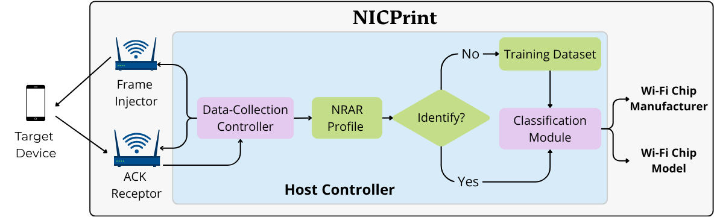

# NICPrint Artifact Evaluation

This repository is the artifact for **"NICPrint: Wi-Fi NIC Identification via Malformed Preambles"**, submitted to NDSS 2027. The code is released under the Apache 2.0 license (see [LICENSE](./LICENSE)) and the datasets under CC-BY-4.0.

*Note*: after we address the reviewers' feedback, this repository, the datasets, and the other repositories listed in the [Overview](#overview) will be packaged into a single Zenodo repository.

## Overview
NICPrint is composed of different modules (see figure below) scattered across the following repositories:
* [SPLICE-project/openwifi](https://github.com/SPLICE-project/openwifi/tree/stf_zero_samp): Our fork of [open-sdr/openwifi](https://github.com/open-sdr/openwifi), which contains the drivers (compiled and source code), byte-crafting programs (compiled and source code), and scripts to operate the Frame Injector, ACK Receptor, and part of the Data-Collection Controller. 
* [SPLICE-project/openwifi-hw](https://github.com/SPLICE-project/openwifi-hw): Our fork of [open-sdr/openwifi-hw](https://github.com/open-sdr/openwifi-hw), which contains the Xilinx bitstream and Verilog source code for the Frame Injector. Note that currently we only really support the AntSDR E200. 
* [SPLICE-project/nicprint-clf](https://github.com/SPLICE-project/nicprint-clf): This repository, which contains the Classification Module and (for the purpose of this evaluation) the part of the Data-Collection Controller in charge of computing the NRAR profiles.



Since an end-to-end evaluation of NICPrint would require a lot of specialized hardware (e.g., a board supporting OpenWiFi, different Wi-Fi NICs) as well as a significant amount of time to produce enough captures/transmissions, we focus this evaluation on the computation of NRAR profiles from raw pcaps and the training/testing of classifiers with our existing datasets (i.e., the evaluation focuses on part of the Data-Collection Controller and Classification Module only). 

We provide our datasets in the following three formats:
* `nicprint-raw-data.tar.gz`: raw pcaps as captured by the ACK Receptor (size = 3.6 GB)
* `nicprint-ir-data.tar.gz`: captures in an "intermediate representation", which shows whether a specific transmission elicited an ACK for a given set of parameters (size = 2.6 MB)
* `nicprint-proc-data.tar.gz`: pre-computed NRAR profiles (size = 786 KB)

Listed in order from "less processed" to "more processed". 

This entire evaluation can be done with any of the dataset representations (see below), but note that the "less processed" representations result in longer running times (since processing takes a significant amount of time).

### Interpreting the results

The experiments might not reproduce the paper's numbers exactly: bootstrap resampling is unseeded, and E2 and E3 retrain the classifiers. What should reproduce is the relative behavior of the classifiers, the classes and positions that account for most of the errors, and the accuracy thresholds claimed in the paper.

*Known naming discrepancy*: the E2 scripts label the RPi 4's chipset `BRCM4345C0` in their metrics tables, where the paper uses `BCM4345C0` (Tables II and IV). The label differs only; no result is affected. We will fix it when the artifact is packaged for Zenodo.

*Known extraction warnings*: the tarballs were created on macOS, so GNU tar on Linux prints `Ignoring unknown extended header keyword 'SCHILY.xattr.com.apple.provenance'` (and similar lines for other macOS attributes) while extracting. The warnings are harmless and extraction completes normally. We will regenerate the archives without these attributes when the artifact is packaged for Zenodo.

### Security and ethics

Nothing in this artifact transmits, captures, or modifies network traffic: E1-E3 only read the datasets we provide and train or run classifiers on them. The captures were collected in our own lab from devices we own. The ACK captures hold only ACK frames addressed to a single synthetic MAC address. The helper captures (`help_cap.pcap`), which E3 uses to count how many of the transmitted frames were observed, also recorded whatever else was on the channel at the time: a small number of management frames from nearby third-party devices, together with their MAC addresses. Our pipeline only counts frames; it does not inspect or decrypt payloads.

An end-to-end NICPrint system, built from the openwifi and openwifi-hw forks linked in the Overview, transmits malformed Wi-Fi frames and can fingerprint the NICs of nearby devices. Build and use it only on devices and networks you own or have explicit permission to test, and only where those transmissions are permitted by the applicable spectrum regulations.

## Requirements

Everything NICPrint needs is bundled in the Docker image; Docker Engine is the only software the evaluator has to install.

* **Hardware**: no GPU required, and no NICPrint hardware either: E1-E3 run entirely from the provided datasets, so no AntSDR E200 board, SDR, or Wi-Fi NICs are needed. We tested on an Apple Silicon (M2 Pro) Mac with 10 cores and 16 GB of RAM, and on an x86-64 Fedora 43 machine with 20 cores and 32 GB of RAM.
* **Software**: Docker Engine (tested with 29.7.2) on macOS 26.6 and Fedora 43 (kernel 7.1.5).
* **Disk space**: ~4 GB if you run the experiments from the pre-computed datasets (P), or ~50 GB if you start from the raw pcaps (R).


## Evaluation Roadmap

| Experiment | What it does | Dataset | Cost |
|---|---|---|---|
| [E1](#e1-30-human-minutes--01-compute-hour) | Reproduces the paper's evaluations from our pre-computed weights and profiles | pre-computed profiles | 30 human-min + 0.1 compute-hour |
| [E2](#e2-30-human-minutes--05-compute-hour-p-or-60-compute-hour-r) | Repeats them with classifiers the evaluator trains | (P) profiles or (R) raw pcaps | 30 human-min + 0.5 (P) / 6.0 (R) compute-hour |
| [E3](#e3-15-human-minutes--02-compute-hour-p-or-52-compute-hour-r) | Ablations: number of transmitted frames (p), step size for zeroed STF samples (s) | (P) IR or (R) raw pcaps | 15 human-min + 0.2 (P) / 5.2 (R) compute-hour |

**(R)** starts from the raw pcaps and recomputes everything; **(P)** starts from the pre-computed data we provide. (R) takes substantially longer and produces the same files that (P) ships.

*Note*: the compute times reported throughout this README depend on the number of available cores; the figures we give were measured on the Apple Silicon (M2 Pro) Mac described in [Requirements](#requirements).

## Kick-the-Tires

The [E1 Preparation](#preparation) steps plus [E1-A](#e1-a-cross-device-evaluation-section-vii) serve as the basic test of the artifact. If E1-A prints its metrics table without errors, the container, the dataset mount, and the pre-computed weights are all set up correctly; comparing the numbers against the paper can wait until the full evaluation.

## E1 [30 human-minutes + 0.1 compute-hour]
The **E1** experiments are meant to reproduce the paper's main evaluations with pre-computed weights and data (i.e., the same weights and data used in the paper). Note that small, negligible differences should be expected in terms of CI and averages since the bootstrapping method is unseeded and thus the bootstrapping resampling is still stochastic.   

### Preparation
1. Download `nicprint-proc-data.tar.gz`:
    ```bash
    export NICPRINT_DATA_BASE="https://huggingface.co/datasets/carguelloM/nicprint-data/resolve/main"
    mkdir -p $HOME/nicprint-eval/nicprint-proc-data 
    cd $HOME/nicprint-eval/nicprint-proc-data 
    wget -c $NICPRINT_DATA_BASE/nicprint-proc-data.tar.gz
    wget -c $NICPRINT_DATA_BASE/SHA256SUMS
    sha256sum -c --ignore-missing SHA256SUMS && tar xzf nicprint-proc-data.tar.gz 
    cd $HOME/nicprint-eval
    mkdir -p figs-e1 results-e1
    ```
    *Note*: these download commands will be updated once the datasets move to Zenodo.

2. Get NICPrint's Docker container:

    Pull the pre-built version:
    ```bash
    ```

    **OR** build from source:
    ```bash
    cd $HOME/nicprint-eval
    git clone https://github.com/SPLICE-project/nicprint-clf.git
    docker build -t nicprint:1.0 nicprint-clf
    ```


3. Run the Docker container:
    ```bash
    docker run --rm -it --hostname nicprint \
        --user "$(id -u):$(id -g)" \
        --group-add 0 \
        -v "$PWD/results-e1:/home/evaluator/nicprint-clf/results:Z" \
        -v "$PWD/figs-e1:/home/evaluator/nicprint-clf/figs:Z" \
        -v "$HOME/nicprint-eval/nicprint-proc-data:/home/evaluator/DATA_ROOT:ro,Z" \
        nicprint:1.0
    ```

    *Note*: The outputs saved to `results` and `figs` are accessible outside the Docker container (i.e., on the evaluator's system) in `$HOME/nicprint-eval` as `results-e1` and `figs-e1`. 

    A successful execution drops you into a shell as follows:
    ```bash
    evaluator@nicprint:/home/evaluator/nicprint-clf$
    ```

#### E1-A: Cross-Device Evaluation (Section VII)
Inside NICPrint's Docker container, run:
```bash
python3 src/diff_dev.py --plot | tee results/diff_dev.out
```
Optionally pass the `--print_missclf` flag if you would like to see every misclassified profile (as well as the predicted and correct label).

The per-class F1/Recall/Accuracy for the chipset and manufacturer classification tasks are printed to the terminal (and written to `results-e1/diff_dev.out`, accessible from the evaluator's system) for comparison with Table VII (chipset classification) and Table VIII (manufacturer classification) in Appendix B of the paper. 

The performance-accuracy graphs for both tasks are saved in `figs-e1/diff_dev/diff_dev.pdf` for comparison with Fig. 8 in the paper. 

**Expected Output**:
* Average chipset-classification accuracy: RF 92%, SVM 99%, LR 97%.
* Average manufacturer-classification accuracy: RF 89%, SVM 100%, LR 95%.
* Per-class metrics match Tables VII and VIII of the paper (within error).
* Most 95% CI half-widths are near zero, with notable exceptions in the RTL, BCM and QCM classes (manufacturer classification) and the RTL8821AU and BCM4360 classes (chipset classification).

#### E1-B: Unseen Channel Evaluation (Section VIII)
Inside NICPrint's Docker container, run:
```bash
python3 src/diff_pos.py --plot | tee results/diff_pos.out
```
Optionally pass the `--print_missclf` flag if you would like to see every misclassified profile (as well as the predicted and correct label).

The per-class and per-position F1/Recall/Accuracy for the chipset and manufacturer classification tasks are printed to the terminal (and written to `results-e1/diff_pos.out`, accessible from the evaluator's system) for comparison with Table X (chipset classification) and Table IX (manufacturer classification) in Appendix C of the paper. 

The performance-accuracy graphs for both tasks are saved in `figs-e1/diff_pos/diff_pos.pdf` for comparison with Fig. 10a (manufacturer classification) and Fig. 10c (chipset classification) in the paper. 

**Expected Output**:
* Average chipset- and manufacturer-classification accuracy per position:

  | Position | Chipset (RF / SVM / LR) | Manufacturer (RF / SVM / LR) |
  |---|---|---|
  | P1 | 97% / 93% / 86% | 84% / 93% / 73% |
  | P2 | 48% / 73% / 73% | 55% / 94% / 52% |
  | P3 | 73% / 95% / 96% | 75% / 93% / 83% |
  | P4 | 75% / 70% / 52% | 98% / 93% / 87% |
  | P5 | 100% / 98% / 75% | 100% / 98% / 73% |

* SVM is the only classifier whose manufacturer accuracy stays above 92% at every position; P2 produces the widest spread between classifiers on that task.
* Per-class metrics match Tables IX and X of the paper (within error).
* Many 95% CI half-widths are zero, and RF's median manufacturer half-width is smaller than SVM's and LR's (see the footnote of Table IX). The notable exception is RTL8821AU precision at P4 under SVM and LR on the chipset task (see the footnote of Table X).

#### E1-C: Unseen Channel Evaluation with Two-Stage Classifier (Section VIII)
Inside NICPrint's Docker container, run:
```bash
python3 src/diff_pos_vote.py --top2 --plot | tee results/diff_pos_vote.out
```
Optionally pass the `--print_missclf` flag if you would like to see every misclassified profile (as well as the predicted and correct label).

The per-class and per-position F1/Recall/Accuracy/Top-2 Accuracy for the chipset classification task are printed to the terminal (and written to `results-e1/diff_pos_vote.out`, accessible from the evaluator's system). These per-class metrics are not reported in the paper. Accuracies can be compared to those in Fig. 11 (Accuracy) and Fig. 12 (Top-2 Accuracy). The figures saved to `figs-e1/diff_pos/diff_pos_vote.pdf` and `figs-e1/diff_pos/diff_pos_vote_top2.pdf` are directly comparable to the aforementioned figures in the paper.

**Expected Output**:
* Average chipset-classification accuracy per position (Top-2 accuracy in parentheses):

  | Position | RF | SVM | LR |
  |---|---|---|---|
  | P1 | 93% (93%) | 91% (92%) | 78% (91%) |
  | P2 | 47% (79%) | 61% (78%) | 73% (79%) |
  | P3 | 94% (94%) | 93% (93%) | 92% (93%) |
  | P4 | 84% (93%) | 89% (93%) | 74% (93%) |
  | P5 | 98% (98%) | 98% (98%) | 79% (98%) |

* The largest gains over the single-stage (E1-B) classifier appear at P4. 
* Top-2 accuracy is at or above 90% at P1, P3, P4, and P5. P2 is the worst case for all classifiers.

#### E1-D: Channel Augmentation (Section IX)
Inside NICPrint's Docker container, run:
```bash
python3 src/chn_aggu.py --plot | tee results/chn_aug.out
```
Optionally pass the `--print_missclf` flag if you would like to see every misclassified profile (as well as the predicted and correct label). Note that the script without the `--train` flag just performs inference on the profiles of a given position using the model weights stored in `models/chn_aug` (i.e., the script does not run the *full* leave-one-position-out procedure described in Section IX). The same script, but with the `--train` flag, is used in [E2-D](#e2-d-channel-augmentation-section-ix) below.

The per-class and per-position F1/Recall/Accuracy for the chipset and manufacturer classification tasks are printed to the terminal (and written to `results-e1/chn_aug.out`, accessible from the evaluator's system). These per-class metrics are not reported in the paper. Accuracies can be compared to those in Fig. 10b (manufacturer classification) and Fig. 10d (chipset classification). The figure saved to `figs-e1/chn_agu/chn_agu_held_out.pdf` is directly comparable to the aforementioned figure in the paper.

**Expected Output**:
* Average chipset- and manufacturer-classification accuracy per held-out position:

  | Held-out position | Chipset (RF / SVM / LR) | Manufacturer (RF / SVM / LR) |
  |---|---|---|
  | P1 | 100% / 98% / 99% | 100% / 99% / 98% |
  | P2 | 73% / 87% / 90% | 95% / 99% / 89% |
  | P3 | 100% / 99% / 97% | 100% / 99% / 98% |
  | P4 | 97% / 77% / 75% | 100% / 99% / 95% |
  | P5 | 100% / 100% / 99% | 100% / 100% / 100% |

* Channel augmentation improves accuracy at every position and for every classifier relative to the base classifiers (E1-B).
* Chipset accuracy stays at or above 90% (within error) everywhere except P2 (RF, SVM) and P4 (SVM, LR).

This is the end of **E1**; make sure to `exit` the Docker container.

## E2 [30 human-minutes + 0.5 compute-hour (P) OR 6.0 compute-hour (R)]
The **E2** experiments are meant to reproduce the paper's main evaluations with classifiers trained by the evaluator. Note that the differences with respect to the metrics reported in the paper can be larger for this experiment than for [E1](#e1-30-human-minutes--01-compute-hour) since training is a stochastic process and there is no guarantee that evaluators will converge on the same weights as the authors. The relative behavior of the classifiers and the classes that account for most of the errors should match the paper, even where individual position/classifier cells move by several percentage points; in our runs only two-stage chipset accuracy at P2 moved by more than ten.

**Expected Output**: for every E2 experiment, the same qualitative behavior as the corresponding E1 experiment: the same classes dominate the errors, and classifier rankings change only between accuracies within error of one another. Most cells fall inside the 95% CIs that E1 reports; training is stochastic, so a few do not, most notably two-stage chipset accuracy at P2 (in our test runs).

### Preparation
1. Complete E1 before starting E2.
2. Get the dataset:

    For evaluation with raw pcaps (R):
    ```bash
    export NICPRINT_DATA_BASE="https://huggingface.co/datasets/carguelloM/nicprint-data/resolve/main"
    mkdir -p $HOME/nicprint-eval/nicprint-raw-data 
    cd $HOME/nicprint-eval/nicprint-raw-data 
    wget -c $NICPRINT_DATA_BASE/nicprint-raw-data.tar.gz
    wget -c $NICPRINT_DATA_BASE/SHA256SUMS
    sha256sum -c --ignore-missing SHA256SUMS && tar xzf nicprint-raw-data.tar.gz
    cd $HOME/nicprint-eval
    mkdir -p figs-e2 results-e2 proc_data-e2
    ```
    *Note*: `nicprint-raw-data.tar.gz` is 3.6 GB; depending on your download speed, it may take a long time to fetch. The fetching time is **not** included in the compute-hour estimate.

    For evaluation with pre-computed profiles (P):
    ```bash
    export NICPRINT_DATA_BASE="https://huggingface.co/datasets/carguelloM/nicprint-data/resolve/main"
    mkdir -p $HOME/nicprint-eval/nicprint-proc-data 
    cd $HOME/nicprint-eval/nicprint-proc-data 
    wget -c $NICPRINT_DATA_BASE/nicprint-proc-data.tar.gz
    wget -c $NICPRINT_DATA_BASE/SHA256SUMS
    sha256sum -c --ignore-missing SHA256SUMS && tar xzf nicprint-proc-data.tar.gz 
    cd $HOME/nicprint-eval
    mkdir -p figs-e2 results-e2
    ```
3. Run the Docker container:
    
    For evaluation with raw pcaps (R):
    ```bash
    docker run --rm -it --hostname nicprint \
        --user "$(id -u):$(id -g)" \
        --group-add 0 \
        -v "$PWD/results-e2:/home/evaluator/nicprint-clf/results:Z" \
        -v "$PWD/figs-e2:/home/evaluator/nicprint-clf/figs:Z" \
        -v "$PWD/proc_data-e2:/home/evaluator/DATA_ROOT:Z" \
        -v "$HOME/nicprint-eval/nicprint-raw-data:/home/evaluator/RAW_DATA:ro,Z" \
        nicprint:1.0
    ```
    *Note*: The outputs saved to `results` and `figs` are accessible outside the Docker container (i.e., on the evaluator's system) in `$HOME/nicprint-eval` as `results-e2` and `figs-e2`.

    *Note*: `proc_data-e2` is mapped to the evaluator's system. This directory is where the processed profiles will be saved, and it can be remounted in the Docker container to continue processing without restarting from zero in case of a failure of the Docker container. 

    For evaluation with pre-computed profiles (P):
    ```bash
    docker run --rm -it --hostname nicprint \
        --user "$(id -u):$(id -g)" \
        --group-add 0 \
        -v "$PWD/results-e2:/home/evaluator/nicprint-clf/results:Z" \
        -v "$PWD/figs-e2:/home/evaluator/nicprint-clf/figs:Z" \
        -v "$HOME/nicprint-eval/nicprint-proc-data:/home/evaluator/DATA_ROOT:ro,Z" \
        nicprint:1.0
    ```
    *Note*: The outputs saved to `results` and `figs` are accessible outside the Docker container (i.e., on the evaluator's system) in `$HOME/nicprint-eval` as `results-e2` and `figs-e2`.

4. If doing a (P) evaluation, skip to 5; otherwise, compute the profiles from the raw pcaps:
    ```bash
    python3 utils/proc_acks.py --captures_dir ~/RAW_DATA/raw_data/scalable --out_dir ~/DATA_ROOT/pickled_data/scalable --mfrs_map mappings/base_map.json
    ```
    *Note*: This step takes ~4 compute-hours in our test system.

5. Train the base classifiers (i.e., 1m-LOS conditions described in Section V) for the manufacturer and chipset classification tasks:
    ```bash
    python3 src/train_base.py --cfm --models_dir ~/evaluator_models/base --save --kind "both" | tee results/base_train.out
    ```
    
    This script performs a 5-fold cross-validation as described in Section VI and saves the classifiers' weights to `~/evaluator_models/base`. The `--cfm` flag produces confusion matrices for all evaluations and saves them as PDFs in `figs-e2/cfm` (accessible from the evaluator's system). 

    The output of the evaluation is printed to the terminal and saved to `results-e2/base_train.out` (accessible from the evaluator's system) for comparison with Table III (manufacturer classification) and Table IV (chipset classification). The weights in `~/evaluator_models/base` are used for all subsequent experiments. 


#### E2-A: Cross-Device Evaluation (Section VII)

If doing a (P) evaluation, skip this step; otherwise, compute the NRAR profiles for the "second device" dataset:
```bash
python3 utils/proc_acks.py --captures_dir ~/RAW_DATA/raw_data/same_chip_diff_cards --out_dir ~/DATA_ROOT/pickled_data/same_chip_diff_cards --mfrs_map mappings/diff_dev_map.json
```
*Note*: This step takes ~15 compute-minutes in our test system.

Repeat E1-A using the newly computed weights. Inside NICPrint's Docker container, run:
```bash
python3 src/diff_dev.py --models_dir ~/evaluator_models/base --plot | tee results/diff_dev.out
```
Compare the results produced by this script (i.e., `results-e2/diff_dev.out` and `figs-e2/diff_dev/diff_dev.pdf`) with those from [E1-A](#e1-a-cross-device-evaluation-section-vii) (i.e., `results-e1/diff_dev.out` and `figs-e1/diff_dev/diff_dev.pdf`) and the metrics reported in the paper (see [E1-A](#e1-a-cross-device-evaluation-section-vii) for table and figure numbers).


#### E2-B: Unseen Channel Evaluation (Section VIII)

If doing a (P) evaluation, skip this step; otherwise, compute the NRAR profiles for the "different position" dataset:
```bash
python3 utils/proc_acks.py --captures_dir ~/RAW_DATA/raw_data/diff_pos --out_dir ~/DATA_ROOT/pickled_data/diff_pos --mfrs_map mappings/diff_pos.json
```
*Note*: This step takes ~1.5 compute-hours in our test system.

Repeat E1-B using the newly computed weights. Inside NICPrint's Docker container, run:
```bash
python3 src/diff_pos.py --models_dir ~/evaluator_models/base --plot | tee results/diff_pos.out
```
Compare the results produced by this script (i.e., `results-e2/diff_pos.out` and `figs-e2/diff_pos/diff_pos.pdf`) with those from [E1-B](#e1-b-unseen-channel-evaluation-section-viii) (i.e., `results-e1/diff_pos.out` and `figs-e1/diff_pos/diff_pos.pdf`) and the metrics reported in the paper (see [E1-B](#e1-b-unseen-channel-evaluation-section-viii) for table and figure numbers).

#### E2-C: Unseen Channel Evaluation with Two-Stage Classifier (Section VIII)
Train the manufacturer-specialized classifiers:
```bash
python3 src/train_base.py --cfm --models_dir ~/evaluator_models/spc --save --kind "special" | tee results/special_train.out
```

Repeat E1-C using the newly computed weights. Inside NICPrint's Docker container, run:
```bash
python3 src/diff_pos_vote.py --models_mfr_dir ~/evaluator_models/base --models_chip_dir ~/evaluator_models/spc --top2 --plot | tee results/diff_pos_vote.out
```
Compare the results produced by this script (i.e., `results-e2/diff_pos_vote.out`, `figs-e2/diff_pos/diff_pos_vote.pdf`, and `figs-e2/diff_pos/diff_pos_vote_top2.pdf`) with those from [E1-C](#e1-c-unseen-channel-evaluation-with-two-stage-classifier-section-viii) (i.e., `results-e1/diff_pos_vote.out`, `figs-e1/diff_pos/diff_pos_vote.pdf`, and `figs-e1/diff_pos/diff_pos_vote_top2.pdf`) and the metrics reported in the paper (see [E1-C](#e1-c-unseen-channel-evaluation-with-two-stage-classifier-section-viii) for figure numbers).

#### E2-D: Channel Augmentation (Section IX)

Train and evaluate new channel-augmented classifiers: 
```bash
python3 src/chn_aggu.py --train --models_dir ~/evaluator_models/ch_aug --plot | tee results/chn_aug.out
```
Compare the results produced by this script (i.e., `results-e2/chn_aug.out` and `figs-e2/chn_agu/chn_agu_held_out.pdf`) with those from [E1-D](#e1-d-channel-augmentation-section-ix) and the metrics reported in the paper (see [E1-D](#e1-d-channel-augmentation-section-ix) for figure numbers).


This is the end of **E2**; make sure to `exit` the Docker container.


## E3 [15 human-minutes + 0.2 compute-hour (P) OR 5.2 compute-hour (R)]

The **E3** experiments are meant to reproduce the paper's ablation findings, where alternative parameters are explored, particularly the number of transmitted frames (p) and the step size for the number of zeroed STF samples (s).  

1. Complete E1 before starting E3.
2. Get the dataset:
    
    For evaluation with raw pcaps (R):
    ```bash
    export NICPRINT_DATA_BASE="https://huggingface.co/datasets/carguelloM/nicprint-data/resolve/main"
    mkdir -p $HOME/nicprint-eval/nicprint-raw-data 
    cd $HOME/nicprint-eval/nicprint-raw-data 
    wget -c $NICPRINT_DATA_BASE/nicprint-raw-data.tar.gz
    wget -c $NICPRINT_DATA_BASE/SHA256SUMS
    sha256sum -c --ignore-missing SHA256SUMS && { [ -d raw_data ] || tar xzf nicprint-raw-data.tar.gz; }
    cd $HOME/nicprint-eval
    mkdir -p figs-e3 results-e3 proc_data-e3
    ```
    
    *Note*: `nicprint-raw-data.tar.gz` is 3.6 GB; depending on your download speed, it may take a long time to fetch. The fetching time is **not** included in the compute-hour estimate. Also note that if you already have `nicprint-raw-data.tar.gz` from E2, then running the command above will skip the download and extraction.

    For evaluation with pre-computed IR (P):
    ```bash
    export NICPRINT_DATA_BASE="https://huggingface.co/datasets/carguelloM/nicprint-data/resolve/main"
    mkdir -p $HOME/nicprint-eval/nicprint-ir-data 
    cd $HOME/nicprint-eval/nicprint-ir-data 
    wget -c $NICPRINT_DATA_BASE/nicprint-ir-data.tar.gz
    wget -c $NICPRINT_DATA_BASE/SHA256SUMS
    sha256sum -c --ignore-missing SHA256SUMS && tar xzf nicprint-ir-data.tar.gz 
    cd $HOME/nicprint-eval
    mkdir -p figs-e3 results-e3
    ```
3. Run the Docker container:

    For evaluation with raw pcaps (R):
    ```bash
    docker run --rm -it --hostname nicprint \
        --user "$(id -u):$(id -g)" \
        --group-add 0 \
        -v "$PWD/results-e3:/home/evaluator/nicprint-clf/results:Z" \
        -v "$PWD/figs-e3:/home/evaluator/nicprint-clf/figs:Z" \
        -v "$PWD/proc_data-e3:/home/evaluator/DATA_ROOT:Z" \
        -v "$HOME/nicprint-eval/nicprint-raw-data:/home/evaluator/RAW_DATA:ro,Z" \
        nicprint:1.0
    ```
    *Note*: The outputs saved to `results` and `figs` are accessible outside the Docker container (i.e., on the evaluator's system) in `$HOME/nicprint-eval` as `results-e3` and `figs-e3`.

    For evaluation with pre-computed IR (P):
    ```bash
    docker run --rm -it --hostname nicprint \
        --user "$(id -u):$(id -g)" \
        --group-add 0 \
        -v "$PWD/results-e3:/home/evaluator/nicprint-clf/results:Z" \
        -v "$PWD/figs-e3:/home/evaluator/nicprint-clf/figs:Z" \
        -v "$HOME/nicprint-eval/nicprint-ir-data:/home/evaluator/DATA_ROOT:ro,Z" \
        nicprint:1.0
    ```
    *Note*: The outputs saved to `results` and `figs` are accessible outside the Docker container (i.e., on the evaluator's system) in `$HOME/nicprint-eval` as `results-e3` and `figs-e3`.

4. If doing a (P) evaluation, skip this step; otherwise, compute the IR for the pcaps:
    ```bash
    python3 utils/proc_acks_ablation.py --captures_dir ~/RAW_DATA/raw_data/scalable
    ```
    *Note*: This step takes ~5 compute-hours in our test system.

#### E3-A: Ablation - Number of Transmitted Frames (Section XI)

Inside NICPrint's Docker container, run:
```bash
python3 src/ablation.py --tx_num | tee results/tx_num_ablation.out
```
Compare the results in `figs-e3/ablation_tx_*.pdf` with those presented in Fig. 13a. The figure in the paper only shows our results for SVM (due to space limitations), but the general trend for all classifiers is the same. Evaluators should not expect a point-by-point comparison since the script retrains models with a downsampled version of the original pcap (as described in Section XI). See `results-e3/tx_num_ablation.out` for the exact computed accuracies.

**Expected Output**:
* For *all* classifiers, accuracy is above 95% (within error) for both manufacturer and chipset classification once the number of transmitted frames is *equal to or larger* than 250 (i.e., p>=250).

#### E3-B: Ablation - Step Size for Zeroed STF Samples (Section XI)
Inside NICPrint's Docker container, run:
```bash
python3 src/ablation.py --tx_step | tee results/tx_step.out
```
Compare the results in `figs-e3/ablation_step_*.pdf` with those presented in Fig. 13b. The figure in the paper only shows our results for SVM (due to space limitations), but the general trend for all classifiers is the same. Evaluators should not expect a point-by-point comparison since the script retrains models with a downsampled version of the original pcap (as described in Section XI). See `results-e3/tx_step.out` for the exact computed accuracies.

**Expected Output**:
* For *all* classifiers, accuracy is above 95% (within error) for both manufacturer and chipset classification once the step size for the number of zeroed STF samples is *equal to or smaller* than 10 (i.e., s<=10).

This is the end of **E3**; make sure to `exit` the Docker container.